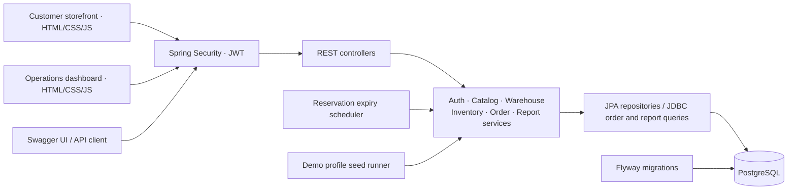
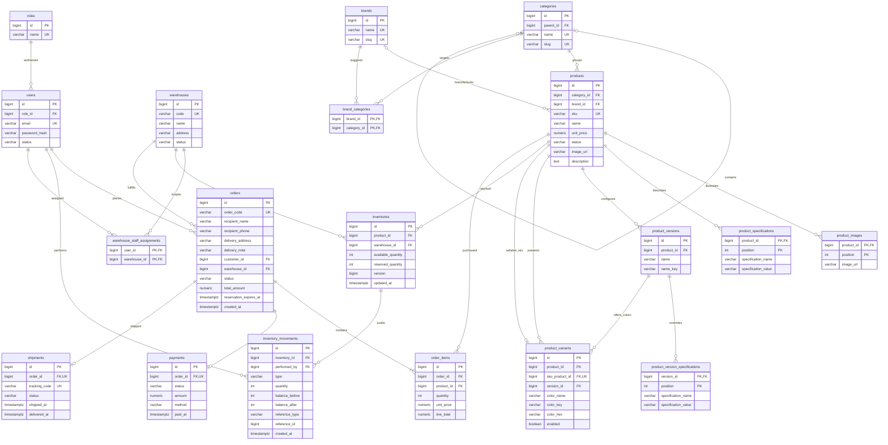

<!-- StockFlow Tech tập trung phụ kiện máy tính; phân biệt tính năng đã có với lộ trình mua hàng còn lại. -->
# StockFlow – Technology Storefront & Multi-Warehouse Management

A shopping website for **one computer-accessories and technology retailer owning multiple warehouses**, developed as a Java Backend Developer portfolio project. The customer-facing brand is **StockFlow Tech**. Customers browse products, build a cart, place orders, and follow their own purchases; administrators and warehouse staff manage catalog, inventory, fulfillment, and business reports. StockFlow focuses on transactional correctness: concurrent customers cannot oversell stock, every inventory change produces an immutable audit entry, and reports aggregate actual order data.

The backend and two Vietnamese interfaces are implemented: a **customer storefront** and an **operations dashboard**, served directly by Spring Boot using HTML, CSS, and vanilla JavaScript. Guests and customers use the shop; operational accounts enter the dashboard. This is a single-store system, with no seller/tenant marketplace model.

<!-- V15 bổ sung checkout người nhận đã chốt, giữ đơn lịch sử và các quy tắc tồn kho hiện có. -->
Checkout now requires a recipient name, phone number, and delivery address, with an optional note. Shipping is free in this MVP. Each order stores its own fixed delivery snapshot, visible to its owner and authorized warehouse operators. To change delivery details, cancel a PENDING order and place a new one. Flyway V15 preserves existing orders without inventing historical addresses. See [checkout rules, API contract, and verification](docs/checkout-delivery.md).

<!-- Chi tiết sản phẩm có dữ liệu thật; mô tả do Admin nhập, không sinh thông số hay khuyến mãi giả. -->
Clicking a product card opens its own public page at `/san-pham/{id}`, with the saved image, SKU, category, price, and optional description. Links support new tabs, direct reloads, and browser Back/Forward; the cart remains in memory during in-app navigation. The separate Add to cart button still adds quickly. Customers choose a branch and quantity on the detail page. Admins create, edit, or clear plain-text descriptions of up to 5,000 characters. Flyway V7 adds the nullable field without replacing existing catalog or sales data. See [product pages and description editing](docs/product-details.md).

<!-- Bộ ảnh V8 do Admin nhập; không tự thêm ảnh góc chụp hoặc viết lại ảnh bìa cũ. -->
Product detail pages include a gallery with clickable thumbnails, previous/next controls, and arrow-key navigation. Admin forms accept up to **eight additional image URLs**, one per line, alongside the existing cover URL. Flyway V8 stores their order in `product_images`; public catalog responses expose `image_urls`. Existing products start with no additional photos and keep their cover images. See [gallery management and verification](docs/product-gallery.md).

<!-- V12 theo quyết định người dùng: một thẻ model, chọn phiên bản rồi màu, giữ SKU và lịch sử. -->
Admins enter common **technical specifications** and use **Phiên bản & màu** to define configurations such as watch size/connectivity or phone capacity, then add color SKUs within each version. Shoppers see **one card per model**, select a version and a valid color, and get the correct price, images and specifications. Each combination has independent warehouse stock; the original SKU and inventory/order links are preserved. Flyway V12 upgrades V11 color groups without inferring technical data or merging existing products. See [configuration, API contracts, and verification](docs/product-models-versions-and-colors.md).

<!-- Danh mục nhiều cấp và hãng có khóa ngoại thật; bộ lọc chip/RAM/màn hình chuyên biệt còn trong lộ trình. -->
The storefront header includes a multi-column category menu populated from the database. Flyway V9 separates **Phones** from the **Apple** brand; V10 adds up to three category levels and reference brands for laptops, audio/microphones, watches/cameras, and household/personal-care electrical devices, following the supplied CellphoneS screenshots. Admins select the category path and brand when adding products, and can create further categories or brands through the dashboard.

Shoppers can combine category (including its descendants), brand, name/SKU, minimum/maximum price, and price/newest sorting. Laptop and audio menus have their own suggested price ranges. Filters run in the database before pagination, with a stable product-ID tie-breaker. Existing catalog and stock data are preserved; reference categories do not populate the store with products. See [categories, brands, API contracts, and verification](docs/catalog-categories-and-brands.md).

<!-- V13 hoàn thiện ba nhóm còn thiếu và thêm logo hãng do ADMIN nhập, không thêm sản phẩm mẫu. -->
Flyway V13 completes the **TVs/electrical appliances, accessories, and used goods** category branches from the supplied reference screenshots. Brands are shared across new and used goods. Admins can paste an optional image/logo URL when creating a brand, or use **Sửa logo** on an existing brand to preview, save, replace, or clear it. Public brand responses expose `logo_url`; category menus show the saved logo alongside the brand name and keep a text fallback when the image cannot load. See [catalog completion and brand logos](docs/catalog-completion-and-brand-logos.md).

<!-- CRUD danh mục giữ cây/ID và bảo vệ SKU; runner nhập tay không hoàn tác xóa/đổi slug khi restart. -->
The admin category table includes search by name/slug/ID/path and per-row **Edit / Delete** actions. Edits preserve category IDs and hierarchy; deletion is limited to empty leaf categories, including a check for inactive SKUs. Unused brand suggestions are removed transactionally while brands and sales data remain intact. With catalog seeding disabled, restarts preserve manual catalog edits/deletions. A fresh V13 database contains 125 reference categories; the five legacy Tech demo groups are added only when sample catalog seeding is enabled. See [usage, API rules, and verification](docs/category-management.md).

See [the product audit and phased roadmap](docs/storefront-roadmap.md) and [the current handoff](ANTIGRAVITY_HANDOFF.md) for implemented scope, pending business decisions, and acceptance criteria.

The initial technology groups (keyboards/mice, audio, webcams/microphones, hubs/chargers, and desk accessories) remain available alongside the expanded menu. Each sellable configuration is a separate SKU with its own price and warehouse inventory. The store owner chooses which reference categories to stock; no suppliers or marketplace sellers are introduced. See [the technology-store scope](docs/tech-store.md) and [the expanded catalog](docs/catalog-categories-and-brands.md).

The local `stockflow` database on PostgreSQL host port 5432 was backed up and reset at the owner's request on 2026-10-01. At the time of that reset, it had five technology categories and an empty product catalog; demo accounts, the three warehouses, and staff assignments were preserved. The owner now manages the catalog manually. This was a one-time operation, documented in [the local reset record](docs/tech-store.md#reset-catalog-cục-bộ-đã-thực-hiện). Default demo startup does not create products: add them through the admin dashboard, then receive stock.

## Technical goals

- Keep inventory consistent across order creation, payment simulation, cancellation, and reservation expiry.
- Enforce both role permissions and resource ownership, including warehouse assignments for staff.
- Make SQL performance decisions using measured query plans.
- Provide a reproducible demo, documented API, automated tests, and a packaged application.

## Tech stack

| Area | Technology |
| --- | --- |
| Language and framework | Java 17, Spring Boot 3.4.5 |
| Persistence | PostgreSQL, Spring Data JPA / Hibernate, Spring JDBC |
| Schema management | Flyway; Hibernate schema validation |
| Authentication | Spring Security, JWT, BCrypt |
| API documentation | SpringDoc OpenAPI 2.8.5, Swagger UI |
| Validation and tests | Jakarta Bean Validation, JUnit 5, Spring Boot Test, MockMvc, H2 |
| Build and delivery | Maven Wrapper, Docker Compose, GitHub Actions |
| Web interfaces | HTML5, CSS3, vanilla JavaScript, same-origin fetch; no frontend build |

H2 provides isolated integration tests without requiring Docker. PostgreSQL remains the application database; its ledger trigger and report query plans are database-specific.

## Architecture

The application is a modular monolith. Controllers handle HTTP and role checks, services define transaction boundaries and ownership rules, and repositories implement persistence.



## Database ERD



An inventory is unique per `(product_id, warehouse_id)`; an order has at most one payment and one shipment. Order items snapshot prices so later catalog edits cannot change an existing order's amount.

## Engineering highlights

### Concurrency control

Stock reservation uses an **atomic conditional update**, with the stock check performed by the database in the same statement:

```sql
UPDATE inventories
SET available_quantity = available_quantity - :quantity,
    reserved_quantity = reserved_quantity + :quantity,
    version = version + 1,
    updated_at = now()
WHERE id = :inventoryId
  AND available_quantity >= :quantity;
```

Zero affected rows produces `409 Conflict`. Reserving all items, creating the order, and recording movements happen in one transaction; insufficient stock for any item rolls back the entire order.

Items are processed in ascending inventory ID order so concurrent orders acquire inventory locks consistently, preventing the reversed-item deadlock scenario. Payment, cancellation, and expiry also lock the order row to keep transitions and repeated requests consistent.

The concurrency integration test starts **24 buyers competing for 5 units**, checks that exactly 5 orders succeed, and verifies that available stock never becomes negative. Additional tests exercise reversed item order and competing payment/cancellation/expiry requests.

### Immutable audit ledger

`inventory_movements` stores the actor, quantity, physical balance before/after, timestamp, and optional business reference. A **PostgreSQL database trigger rejects UPDATE and DELETE**, including direct SQL attempts. Corrections produce new movements rather than rewriting history.

`physical_quantity = available_quantity + reserved_quantity`. Reserving or releasing changes allocation while keeping physical stock unchanged; payment simulation records a dispatch and reduces physical stock. Initial demo inventory is received through the same transactional stock-in service.

### SQL optimization

Measured with `EXPLAIN (ANALYZE, BUFFERS)` on PostgreSQL 13.2, using a benchmark dataset of **100,000 generated orders and 500,000 order items**:

| Query | Before | After | Improvement |
| --- | ---: | ---: | ---: |
| Top products | 25.507 ms | 4.471 ms | 5.70× |
| Revenue | 0.950 ms | 0.279 ms | 3.41× |

These are medians of five warm-cache samples for the SELECT query, excluding pagination count queries and HTTP overhead. A partial covering index for revenue-bearing orders enables an index-only scan for the measured workload; index selection still depends on selectivity and database statistics.

See [SQL optimization report](docs/sql-optimization-report.md) for SQL, query plans, benchmark conditions, and reproduction commands. The small demo seed is separate from this performance dataset.

## Quickstart

### One command with Docker Compose

Prerequisite: Docker with Compose support and network access for the first image/dependency download.

```bash
docker compose up --build
```

Compose builds the application with Java 17 and the Maven Wrapper, starts PostgreSQL, waits for its health check, and starts the API with the `demo` profile.

- Shop and operations portal: [http://localhost:8080/](http://localhost:8080/)
- Swagger UI: [http://localhost:8080/swagger-ui.html](http://localhost:8080/swagger-ui.html)
- OpenAPI JSON: [http://localhost:8080/v3/api-docs](http://localhost:8080/v3/api-docs)
- Health: [http://localhost:8080/api/v1/health](http://localhost:8080/api/v1/health)
- PostgreSQL from the host: `localhost:5433`, database/user `stockflow`, password `stockflow_local_password`.

The application container connects to `postgres:5432`. The host database port can be changed with `DB_PORT`; `APP_PORT` changes the published API port. Run `docker compose down` to stop the demo while retaining the database volume.

### Run with the Maven Wrapper

Prerequisites: Java 17 and a PostgreSQL instance. To use the Compose database while running Java locally:

```bash
docker compose up -d postgres
chmod +x mvnw
./mvnw -Dspring-boot.run.profiles=demo spring-boot:run
```

Windows PowerShell:

```powershell
docker compose up -d postgres
.\mvnw.cmd '-Dspring-boot.run.profiles=demo' spring-boot:run
```

The local datasource defaults match the Compose database. Customize `DB_HOST`, `DB_PORT`, `DB_NAME`, `DB_USERNAME`, and `DB_PASSWORD` through environment variables or an IDE run configuration.

Compose reads an optional `.env` file; use [.env.example](.env.example) as its template. **Spring Boot launched directly does not automatically load `.env`.**

The `demo` profile supplies a local JWT key and seeds demo data. When running without this profile, set `JWT_SECRET` to a private key of at least 32 bytes. Demo credentials and the demo JWT key are intended for local evaluation.

## Storefront and operations dashboard

Open **[http://localhost:8080/](http://localhost:8080/)** after starting Spring Boot. The Vietnamese dashboard is served directly from `src/main/resources/static/` with HTML, CSS, and vanilla JavaScript. No Node.js installation or separate frontend build is needed.

Run the `demo` profile and open **http://localhost:8080/**. Guests and CUSTOMER accounts see StockFlow Shop: an ACTIVE product card grid, name/SKU search, category filters, pagination, branch selection, and a cart drawer with quantity controls and VND totals. Customer history shows shipment tracking and simulated payment; customers can cancel their own PENDING orders.

<!-- Nút sáng/tối chỉ lưu sở thích giao diện, độc lập với JWT và dữ liệu nghiệp vụ. -->

- The pinned demo bar performs a real JWT login and immediately switches context for Customer, Hanoi Staff, Manager, and Admin. Manual login and customer registration remain available.
- The top bar includes a light/dark toggle for both interfaces. It follows the operating system initially, remembers the visitor's choice in localStorage, and synchronizes that choice across tabs. See [appearance settings](docs/appearance-settings.md).
- Browse/filter/paginate products, build a multi-product cart, select an active warehouse, and create a 15-minute reservation as Customer.
- The separate dashboard opens the scoped order work queue and detail, with the next valid pack/ship/deliver/receive-return action. Shipping accepts an optional tracking code; leaving it blank uses the allocated code.
- Inspect available/reserved/physical inventory, receive stock as Admin/assigned Staff, and read immutable before/after balances as Manager/Admin.
- Inspect order status totals, day/month revenue, top products, and low-stock alerts with filters and pagination.
- Staff see only assigned warehouse choices and operational menus. Managers see ledger/reports; only Admin sees category/product creation and product editing. Customers see no internal forms or menus.
- API banners/toasts and messages inside the cart show actual backend responses, including **409 Conflict** for insufficient stock and **403 Forbidden** for denied access.

Public `GET /api/v1/storefront/branches` supplies only active branch IDs, codes, and names. JWT-protected `GET /api/v1/warehouses/operating-options` returns current staff assignments or all warehouses for management, including inactive warehouses with existing orders. The existing private warehouse list and authenticated `/order-options` contract retain their restrictions. No warehouse IDs are hard-coded.

Product search uses optional `q` on `GET /api/v1/products`, matching name/SKU before pagination. Optional `minPrice`/`maxPrice` include both boundaries and combine with category/status filters. Use `sort=unitPrice,asc` or `sort=unitPrice,desc` for price ordering; unknown sort fields and invalid price ranges return 400. The shop explicitly requests `status=ACTIVE`; administration can filter all statuses. Products expose optional `image_url`, backed by Flyway V6. Admin can enter and preview an image URL when creating or editing a product. PATCH omitting the image or passing null preserves it; an empty string removes it. Only ADMIN can write catalog data.

JWTs are kept in the tab's sessionStorage; manual passwords are not persisted. Logout or switching authenticated accounts clears cart/private results and aborts old requests. Guest-to-customer checkout login keeps the selected cart/branch and asks the customer to review and submit. Refresh validates the actor through `users/me`; invalid tokens return to the public shop. The cart is held in memory and resets on reload. Stored product images take priority over illustrative name/category fallbacks. Hard-coded ratings, sales counts and bestseller labels have been removed.

<!-- Trang chi tiết tham khảo CellphoneS, giữ một thẻ/model và tồn riêng theo SKU thay vì sao chép dữ liệu thương mại. -->
Product details use a retailer-style layout with a full category/brand breadcrumb, a large gallery, version choices and color thumbnails showing each SKU's actual price. Selecting a version or color updates `/san-pham/{skuId}`; reload, sharing and browser Back/Forward retain that choice. Catalog filter URLs retain the category, brand, search and price range.

Public `GET /api/v1/products/{id}/availability` returns only SKU ID, active branch ID/code/name and an `in_stock` flag. Available stock, SKU/model status and variant enablement determine the flag; reserved stock does not count. Responses use `Cache-Control: no-store`. No inventory quantities, internal addresses, actors or ledger data are exposed. Browsing never reserves stock, and transactional checkout remains the final availability check. See [product detail behavior and verification](docs/retail-product-detail.md).

See [product image management and manual catalog mode](docs/product-images.md) and [multi-image galleries](docs/product-gallery.md) for accepted URLs, update/removal behavior, and bootstrap settings. Images use HTTP/HTTPS or local `/assets/` paths; the backend stores URLs and does not download remote files. File upload is not implemented.

Navigation uses `#shop`, `#shop/orders`, and `#portal/queue` (or `/inventory`, `/ledger`, `/reports`, `/admin`). URLs do not grant roles or bypass server warehouse checks. See [phase 3 verification](docs/storefront-dashboard-verification.md).

For an existing PostgreSQL installation in IntelliJ, use Active profiles `demo` and set `DB_PORT`, `DB_USERNAME`, and `DB_PASSWORD` to that installation's credentials (for example, port 5432 and user postgres). This runs the demo seed in the selected database. The Compose database defaults to host port 5433.

## Demo data and accounts

A fresh demo database contains three warehouses:

- **WH-HAN-01** — Kho Tổng Hà Nội.
- **WH-DAD-01** — Kho Đà Nẵng.
- **WH-SGN-01** — Kho TP.HCM.

<!-- Dữ liệu tham chiếu mới không thay thế catalog nhập tay hoặc làm thay đổi hàng đã có trong kho. -->
V9/V10 prepare **71 category references** and **76 shared brands** on a fresh database. The `demo` profile adds the five original technology groups, demo accounts, three warehouses, and the Hanoi staff assignment: **76 categories** in total on a fresh demo database. New databases have no products or inventory by default, allowing the owner to add products and receive stock manually. Existing catalog, orders, images, and audit records are preserved.

Set `DEMO_SEED_CATALOG=true` to opt into the full technology fixture: **24 products** with `TECH-` SKUs, **72 inventory rows**, and **72 GOODS_RECEIPT movements** on a fresh database. Docker Compose reads this setting from `.env`; a local IDE run uses an environment variable. Selected fixture products start below the low-stock threshold; prices and photos are demonstration data. Switching this flag does not delete existing products, orders, or audit records.

| Email | Password | Role | Scope |
| --- | --- | --- | --- |
| admin@stockflow.com | Admin@123 | ADMIN | All warehouses; catalog administration |
| manager@stockflow.com | Manager@123 | MANAGER | Orders, inventory, ledger, reports |
| staff.hn@stockflow.com | Staff@123 | WAREHOUSE_STAFF | Assigned to WH-HAN-01 |
| customer@stockflow.com | Customer@123 | CUSTOMER | Own orders |

Passwords are stored as BCrypt hashes. The seed only adds missing records and inventory pairs; restarting preserves existing prices, passwords, orders, and stock quantities, including inventories that have sold out.

Revenue and top-product reports populate as you create and pay demo orders. The seed does not fabricate historical sales.

## API walkthrough

1. Open Swagger UI and execute `POST /api/v1/auth/login` with a demo email and password.
2. Copy `access_token`, click **Authorize**, and paste the token without the `Bearer ` prefix.
3. Browse `GET /api/v1/products`. Retrieve active warehouse IDs through authenticated `GET /api/v1/warehouses/order-options`.
4. Authorize as the customer and create an order with `POST /api/v1/orders`:

```json
{
  "warehouse_id": 1,
  "items": [
    { "product_id": 1, "quantity": 2 }
  ],
  "delivery": {
    "recipient_name": "Nguyễn Văn An",
    "recipient_phone": "0901234567",
    "address": "12 Phố Mới, phường Cầu Giấy, Hà Nội",
    "note": "Gọi trước khi giao"
  }
}
```

Use IDs returned by your own database; the example IDs are placeholders. The `delivery` object is required for new orders; existing orders without it still work. The server calculates the amount from item prices with no shipping fee. Delivery details are returned by order creation, detail, customer history, and lifecycle actions; the operations list remains a minimal summary.

5. The order starts `PENDING` with stock reserved for **15 minutes**. Check `GET /api/v1/orders/my`.
6. Call `POST /api/v1/orders/{id}/payment-simulations/confirm`: the order becomes `CONFIRMED`, the payment becomes `PAID`, and reserved stock is dispatched. Repeating confirmation creates no extra payment or dispatch.
7. Alternatively, cancel a pending order to release stock. Expired reservations are automatically released by the scheduled task.
8. Authorize as manager to inspect inventory movements and the revenue/top-products reports. Reports use UTC order creation dates; use a date range covering the demo orders.
9. Authorize as manager/admin or warehouse staff and call `GET /api/v1/orders?status=CONFIRMED&page=0&size=20`. Add `warehouseId` to filter a specific warehouse. Management can read all warehouses; staff only see assigned warehouses, including the pagination totals. Staff requests explicitly targeting an unassigned warehouse return `403`.

The operations list returns order summaries including `warehouse_name`; use `GET /api/v1/orders/{id}` to read items. It uses a fixed newest-first order (`created_at DESC, id DESC`), zero-based `page`, and `size` from 1 to 100. A staff member without assignments receives an empty page. Customer order history remains at `/api/v1/orders/my`.

### Fulfillment and tracking

Customers continue to choose a warehouse/serving branch at checkout. Each order belongs to one warehouse. Inventory is dispatched at **payment confirmation**, so fulfillment never deducts stock a second time.

As **ADMIN, MANAGER, or assigned WAREHOUSE_STAFF**, call these endpoints in order:

```http
POST /api/v1/orders/{id}/pack
POST /api/v1/orders/{id}/ship
POST /api/v1/orders/{id}/deliver
POST /api/v1/orders/{id}/return
```

- **pack:** CONFIRMED → PACKED; creates/reuses one PREPARING shipment and allocates a unique `SF-TRACK-...` code. The existing schema requires a non-null code at this stage.
- **ship:** PACKED → SHIPPED; records `shipped_at`, using the allocated code or an optional custom code. Omit the body, send `{}`, or send `{"tracking_code":"DEMO-TRACK-001"}`. Codes accept letters, digits, dots, underscores, and hyphens, up to 100 characters; `trackingCode` is also accepted as an input alias.
- **deliver:** SHIPPED → DELIVERED; records `delivered_at` and preserves the shipping timestamp/code.
- **return:** DELIVERED → RETURNED means the whole order has been received back. Restocks all items in inventory-ID order, creates one RETURN_RESTOCK movement per item, and changes simulated payment to REFUNDED in the same transaction.

Detail/mutation responses and `/orders/my` now include `shipment` with `tracking_code`, `status`, `shipped_at`, and `delivered_at`; it is null before packing. Customer ownership checks still apply. The operations summary list stays compact; read details to obtain shipment/items.

Each action locks the order and checks warehouse access before changing state. Repeating an action at its exact target state returns 200 without extra writes. Skipping steps, calling an earlier step after later progress, changing an already shipped code, or reusing another order's tracking code returns 409. Bad tracking/body data returns 400. Customers cannot operate fulfillment; unassigned/out-of-scope staff receive 403. Cancellation is allowed before shipping for eligible management actions, and blocked after SHIPPED. A cancelled PACKED order keeps its PREPARING shipment as history and cannot be shipped.

The dashboard now exposes these operations directly. See [fulfillment integration tests](src/test/java/com/stockflow/order/FulfillmentIntegrationTest.java) for transaction/concurrency coverage and [frontend verification](docs/storefront-dashboard-verification.md) for the browser walkthrough.

### Endpoint permissions

- **Public:** storefront/static assets, minimal active branch choices (`/api/v1/storefront/branches`), health, registration/login, category/brand/product reads, Swagger UI, OpenAPI documents.
- **Operational warehouse choices:** `/api/v1/warehouses/operating-options` requires an operational role and applies current staff assignments.
- **Authenticated users:** minimal active warehouse choices for order creation (`/api/v1/warehouses/order-options`).
- **ADMIN:** category/brand/product writes and warehouse creation; stock-in across warehouses.
- **ADMIN version/color management:** `POST /api/v1/products/{id}/versions` and `PATCH /api/v1/products/{id}/versions/{versionId}` configure versions and specification overrides. The variants endpoints create/update color SKUs with `version_id`. Public detail includes both selectors; `grouped=true` returns one model card and filters/sorts by the lowest active SKU price before pagination. The default list still returns SKUs for stock-in and existing clients.
- **WAREHOUSE_STAFF:** stock-in, inventory/order reads, and pack/ship/deliver/receive-return within assigned warehouses. Inventory requests must include an assigned `warehouseId`.
- **CUSTOMER:** create orders, read own orders, pay own orders, cancel own pending orders.
- **MANAGER / ADMIN:** cross-warehouse order reads, inventory, audit movements, all four report endpoints, and all fulfillment actions; cancel paid orders before shipment with restocking/refund.

Only `ACTIVE` accounts can log in or authenticate protected requests. Account status is reloaded from the database on every JWT request, so a previously issued token is denied while the account is `INACTIVE`. Refresh tokens and permanent per-token logout revocation are separate future work.

Report endpoints: `/api/v1/reports/revenue`, `/top-products`, `/low-stock`, and `/order-summary`. Revenue supports day/month grouping; paginated reports accept `page` and `size`.

## Tests, build, and CI

macOS/Linux:

```bash
chmod +x mvnw
./mvnw test
./mvnw package
```

Windows PowerShell:

```powershell
.\mvnw.cmd '-Dmaven.repo.local=C:/Users/Admin/.m2/repository' test
.\mvnw.cmd '-Dmaven.repo.local=C:/Users/Admin/.m2/repository' package
```

The explicit Maven repository above is required on the current Windows development machine.

The suite covers authentication and disabled accounts, role/ownership checks, warehouse-scoped order lists and pagination, stock-in transactions, immutable ledger enforcement, order lifecycle and fulfillment, shipment tracking, restock rollback, concurrent pack/return, ship/cancel and tracking-code races, report aggregates/pagination, OpenAPI access, repeatable demo seeding, public web resource delivery, and warehouse order-option permissions.

See [Web demo verification](docs/web-demo-verification.md) for the changed files, 89-test result, and frontend checks against a separate PostgreSQL database.

That report describes the earlier frontend milestone. Current API-phase verification and remaining limitations are recorded in [the storefront roadmap](docs/storefront-roadmap.md).

Phase 3 preserves all **183** accepted tests and adds **11** integration cases: **194 passing tests**, with no failures, errors, or skipped tests. Both `test` and `package` use the explicit Maven repository above. See [phase 3 verification](docs/storefront-dashboard-verification.md) for the changed-file list and **49** Chrome headless checks against PostgreSQL.

<!-- Kiểm chứng cập nhật ảnh sản phẩm và catalog nhập tay; kết quả cũ ở trên là lịch sử từng giai đoạn. -->
The product-image and manual-catalog update adds **24** cases, bringing the current suite to **218 passing tests**. Both `test` and `package` succeed. The PostgreSQL QA database applies V6 successfully; Chrome headless passes **69** checks (49 regression and 20 image-management checks), including mobile layout. See [product images and verification](docs/product-images.md) for API semantics, setup, limitations, and the 24-file change list.

<!-- Kết quả hiện tại sau khi chuyển ngành hàng sang StockFlow Tech; các mốc trên là lịch sử nghiệm thu. -->
The technology-store update brings the current suite to **219 passing tests**, with successful `test` and `package` builds. A fresh PostgreSQL QA database verifies both manual catalog bootstrap and the technology fixture; Chrome headless passes **72** checks. See [StockFlow Tech verification and changed files](docs/tech-store.md).

<!-- Kết quả mới nhất của bộ ảnh; các mốc test phía trên là lịch sử từng lượt. -->
The gallery update brings the suite to **260 passing tests**, including **26 new gallery cases**, with no failures, errors, or skips. Packaging succeeds after the full test run. PostgreSQL QA verifies a V7-to-V8 upgrade that preserves existing cover images, catalog data, inventory, and audit movements. Chrome passes **78 checks** (36 gallery checks and 42 shopping/fulfillment regressions), with no JavaScript exceptions. See [gallery verification and the changed-file list](docs/product-gallery.md).

<!-- Lượt V12 giữ transaction/ledger và kiểm chứng nhóm phiên bản/màu bằng PostgreSQL/Chrome riêng. -->
The version/color update brings the suite to **411 passing tests** (23 new cases), with no failures, errors, or skips. **81 Chrome checks** pass (39 new and 42 regressions), including independent SKUs for the same color across versions, specification overrides, SQL price filtering/paging, checkout/fulfillment/return, direct SKU URLs and mobile layout. Twelve PostgreSQL requests competing for three units produce exactly three orders without consuming other versions. A V11-to-V12 QA upgrade preserves 13 snapshot groups and six existing SKUs. Packaging succeeds; QA helpers do not modify the live database or application. See [full verification and changed files](docs/product-models-versions-and-colors.md).

<!-- Kiểm chứng sau menu/bộ lọc; các mốc dưới là lịch sử nghiệm thu trước V11. -->
The catalog-discovery update adds **35 integration cases**, bringing the suite to **295 passing tests**, with no failures, errors, or skips. JAR packaging succeeds after the full test run. Chrome passes **74 checks** (32 menu/filter checks and 42 shopping/fulfillment regressions) against an isolated PostgreSQL QA database, with no JavaScript exceptions. No schema migration or catalog reset is required. See [the 11 changed files, API semantics, and verification limits](docs/catalog-discovery.md).

<!-- Kết quả mới nhất của hãng/cây danh mục; các mốc phía trên là lịch sử, không phải tổng test hiện tại. -->
The category/brand update brings the suite to **353 passing tests** with no failures, errors, or skips. Packaging succeeds after the full suite. Chrome passes **84 checks** (42 catalog/admin checks and 42 shopping/fulfillment regressions) on isolated PostgreSQL 13.2. Migration snapshots confirm that the local catalog's four existing products, photos, accounts, warehouse assignments, stock, ledger, and orders are preserved. See [verification, backup details, and changed files](docs/catalog-categories-and-brands.md).

GitHub Actions runs `./mvnw test` on pushes and pull requests targeting `main`, using Ubuntu and Temurin Java 17. It then packages and uploads the application JAR. The database tests use H2 and do not require a database service in CI.

The packaged artifact is `target/stockflow-0.0.1-SNAPSHOT.jar`. To run it locally:

```bash
java -jar target/stockflow-0.0.1-SNAPSHOT.jar --spring.profiles.active=demo
```

## Scope and trade-offs

The current API includes catalog administration, warehouse-scoped inventory, stock receipts, reservations, simulated payments, cancellation/refund, reservation expiry, scoped operations order lists, packing, shipping with tracking codes, delivery, full-order returns/restocking/refund, and business reports. Payment and shipping stay simulated in the MVP; no real gateway/carrier calls occur.

The storefront and dashboard cover the existing shopping and fulfillment APIs, including stored product cover URLs, ordered image galleries, plain-text descriptions, public product details, and admin content editing. Customers choose the serving branch/warehouse, one order uses one warehouse, and stock dispatch remains at payment confirmation. Checkout stores a fixed recipient/address/note snapshot on the order and offers free simulated delivery. Structured attribute filters and image uploads remain future work. Partial returns, customer return-request workflows, and real shipping integrations are outside this MVP.

Keep the browser cart for the first storefront version; do not add a `carts` table without a persistence requirement. Keep applied Flyway migrations unchanged, add new migrations only for required schema changes, and preserve the atomic reservations and immutable ledger. PostgreSQL Testcontainers in CI, token refresh/revocation, and operational observability are later hardening tasks. A public deployment or recorded demo can follow the completed shopping flow.

Integration references: [SpringDoc v2](https://springdoc.org/v2/), [GitHub Actions Java/Maven](https://docs.github.com/en/actions/tutorials/build-and-test-code/java-with-maven), [Compose startup dependencies](https://docs.docker.com/compose/how-tos/startup-order/).

<!-- Kiểm chứng trang bán lẻ hiện tại; các mốc phiên bản/màu phía trên được giữ làm lịch sử. -->
The retail product-detail update passes **424 tests** and builds successfully. **114 Chrome checks** pass on the final JAR: 33 new UI cases, 39 version/color regressions and 42 shopping/fulfillment regressions, with no JavaScript exceptions. URL selection, branch availability, error recovery, 320/390px layouts and PostgreSQL overselling checks are verified. Existing migrations and live user data are preserved; see [verification, changed files and limits](docs/retail-product-detail.md).

<!-- Mốc mới nhất V13: bổ sung loại hàng và logo hãng, giữ các mốc cũ làm lịch sử nghiệm thu. -->
The catalog-completion and brand-logo update passes **453 tests** (29 new cases), with no failures, errors, or skips; packaging succeeds. **121 Chrome checks** pass: 40 category/logo checks, 39 version/color regressions, and 42 shopping/fulfillment regressions. V13 has also been applied to the local PostgreSQL database after backup, adding **51 categories and 8 brands** while preserving 15 business-data snapshot groups and all existing category/brand IDs. See [verification, changed files, and usage](docs/catalog-completion-and-brand-logos.md).

<!-- Mốc hiện tại của CRUD danh mục; không thay schema hoặc xóa catalog đang sử dụng. -->
The category-management update passes **479 tests** (26 new cases), with no failures, errors, or skips; JAR packaging succeeds. **66 Chrome checks** pass on isolated PostgreSQL 13.2: 24 category-management checks and 42 shopping/fulfillment regressions. Admins can search, rename, and delete empty categories; categories with children or any product SKU remain protected. Manual catalog mode preserves deletions and renamed slugs across demo-runner restarts. No migration or live catalog changes are required. See [usage, API contracts, the 15 changed files, and verification limits](docs/category-management.md).

<!-- Mốc mới nhất V14 tách quản trị phiên bản/màu, xóa bằng lưu trữ và giữ toàn bộ lịch sử bán hàng. -->
Product configuration management now has separate **Versions** and **Colors** tabs and row actions. Admins can archive a color or an entire version with confirmation, then restore it from the archived list. V14 adds archive flags while preserving SKU IDs, stock, images, specifications, and order history. Checkout, availability, and grouped price queries reject archived choices; existing orders can still be fulfilled or returned. **496 tests PASS** (17 new cases), JAR packaging succeeds, and **69 Chrome checks PASS** (27 configuration checks and 42 shopping/fulfillment regressions) on isolated PostgreSQL 13.2. The V13-to-V14 upgrade preserves 18 snapshot groups. Restart Spring Boot and reload the page to apply the migration and APIs. See [usage, API contracts, 20 changed files, and verification limits](docs/product-configuration-management.md).
