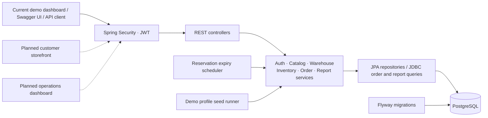

<!-- Tài liệu mô tả cửa hàng nhiều kho, phân biệt tính năng hiện có với lộ trình storefront và dashboard. -->
# StockFlow – Retail Storefront & Multi-Warehouse Management

A shopping website for **one retailer owning multiple warehouses**, developed as a Java Backend Developer portfolio project. Customers browse products, build a cart, place orders, and follow their own purchases; administrators and warehouse staff manage catalog, inventory, fulfillment, and business reports. StockFlow focuses on transactional correctness: concurrent customers cannot oversell stock, every inventory change produces an immutable audit entry, and reports aggregate actual order data.

The existing backend, fulfillment APIs, and Vietnamese demo dashboard are implemented. The final product will have two interfaces: a **customer storefront** and an **operations dashboard**. They will share the current modular backend. The demo page currently combines roles for walkthroughs; separate storefront screens and dashboard fulfillment controls remain planned work. This is a single-store system, with no seller/tenant marketplace model.

See [the product audit and phased roadmap](docs/storefront-roadmap.md) and [the current handoff](ANTIGRAVITY_HANDOFF.md) for implemented scope, pending business decisions, and acceptance criteria.

## Technical goals

- Keep inventory consistent across order creation, payment simulation, cancellation, and reservation expiry.
- Enforce both role permissions and resource ownership, including warehouse assignments for staff.
- Make SQL performance decisions using measured query plans.
- Provide a reproducible demo, documented API, automated tests, and a packaged application.

## Tech stack

| Area | Technology |
| --- | --- |
| Language and framework | Java 17, Spring Boot 3.4.5 |
| Persistence | PostgreSQL, Spring Data JPA / Hibernate, Spring JDBC |
| Schema management | Flyway; Hibernate schema validation |
| Authentication | Spring Security, JWT, BCrypt |
| API documentation | SpringDoc OpenAPI 2.8.5, Swagger UI |
| Validation and tests | Jakarta Bean Validation, JUnit 5, Spring Boot Test, MockMvc, H2 |
| Build and delivery | Maven Wrapper, Docker Compose, GitHub Actions |

H2 provides isolated integration tests without requiring Docker. PostgreSQL remains the application database; its ledger trigger and report query plans are database-specific.

## Architecture

The application is a modular monolith. Controllers handle HTTP and role checks, services define transaction boundaries and ownership rules, and repositories implement persistence.



## Database ERD

```mermaid
erDiagram
    roles ||--o{ users : authorizes
    users ||--o{ orders : places
    users ||--o{ inventory_movements : performs
    users ||--o{ warehouse_staff_assignments : assigned
    warehouses ||--o{ warehouse_staff_assignments : scopes
    categories ||--o{ products : groups
    products ||--o{ inventories : stocked
    warehouses ||--o{ inventories : contains
    inventories ||--o{ inventory_movements : audits
    warehouses ||--o{ orders : fulfills
    orders ||--|{ order_items : contains
    products ||--o{ order_items : purchased
    orders ||--o| payments : paid
    orders ||--o| shipments : shipped

    roles {
        bigint id PK
        varchar name UK
    }
    users {
        bigint id PK
        bigint role_id FK
        varchar email UK
        varchar password_hash
        varchar status
    }
    categories {
        bigint id PK
        varchar name UK
        varchar slug UK
    }
    products {
        bigint id PK
        bigint category_id FK
        varchar sku UK
        varchar name
        numeric unit_price
        varchar status
    }
    warehouses {
        bigint id PK
        varchar code UK
        varchar name
        varchar address
        varchar status
    }
    warehouse_staff_assignments {
        bigint user_id PK,FK
        bigint warehouse_id PK,FK
    }
    inventories {
        bigint id PK
        bigint product_id FK
        bigint warehouse_id FK
        int available_quantity
        int reserved_quantity
        bigint version
        timestamptz updated_at
    }
    inventory_movements {
        bigint id PK
        bigint inventory_id FK
        bigint performed_by FK
        varchar type
        int quantity
        int balance_before
        int balance_after
        varchar reference_type
        bigint reference_id
        timestamptz created_at
    }
    orders {
        bigint id PK
        varchar order_code UK
        bigint customer_id FK
        bigint warehouse_id FK
        varchar status
        numeric total_amount
        timestamptz reservation_expires_at
        timestamptz created_at
    }
    order_items {
        bigint id PK
        bigint order_id FK
        bigint product_id FK
        int quantity
        numeric unit_price
        numeric line_total
    }
    payments {
        bigint id PK
        bigint order_id FK,UK
        varchar status
        numeric amount
        varchar method
        timestamptz paid_at
    }
    shipments {
        bigint id PK
        bigint order_id FK,UK
        varchar tracking_code UK
        varchar status
        timestamptz shipped_at
        timestamptz delivered_at
    }
```



An inventory is unique per `(product_id, warehouse_id)`; an order has at most one payment and one shipment. Order items snapshot prices so later catalog edits cannot change an existing order's amount.

## Engineering highlights

### Concurrency control

Stock reservation uses an **atomic conditional update**, with the stock check performed by the database in the same statement:

```sql
UPDATE inventories
SET available_quantity = available_quantity - :quantity,
    reserved_quantity = reserved_quantity + :quantity,
    version = version + 1,
    updated_at = now()
WHERE id = :inventoryId
  AND available_quantity >= :quantity;
```

Zero affected rows produces `409 Conflict`. Reserving all items, creating the order, and recording movements happen in one transaction; insufficient stock for any item rolls back the entire order.

Items are processed in ascending inventory ID order so concurrent orders acquire inventory locks consistently, preventing the reversed-item deadlock scenario. Payment, cancellation, and expiry also lock the order row to keep transitions and repeated requests consistent.

The concurrency integration test starts **24 buyers competing for 5 units**, checks that exactly 5 orders succeed, and verifies that available stock never becomes negative. Additional tests exercise reversed item order and competing payment/cancellation/expiry requests.

### Immutable audit ledger

`inventory_movements` stores the actor, quantity, physical balance before/after, timestamp, and optional business reference. A **PostgreSQL database trigger rejects UPDATE and DELETE**, including direct SQL attempts. Corrections produce new movements rather than rewriting history.

`physical_quantity = available_quantity + reserved_quantity`. Reserving or releasing changes allocation while keeping physical stock unchanged; payment simulation records a dispatch and reduces physical stock. Initial demo inventory is received through the same transactional stock-in service.

### SQL optimization

Measured with `EXPLAIN (ANALYZE, BUFFERS)` on PostgreSQL 13.2, using a benchmark dataset of **100,000 generated orders and 500,000 order items**:

| Query | Before | After | Improvement |
| --- | ---: | ---: | ---: |
| Top products | 25.507 ms | 4.471 ms | 5.70× |
| Revenue | 0.950 ms | 0.279 ms | 3.41× |

These are medians of five warm-cache samples for the SELECT query, excluding pagination count queries and HTTP overhead. A partial covering index for revenue-bearing orders enables an index-only scan for the measured workload; index selection still depends on selectivity and database statistics.

See [SQL optimization report](docs/sql-optimization-report.md) for SQL, query plans, benchmark conditions, and reproduction commands. The small demo seed is separate from this performance dataset.

## Quickstart

### One command with Docker Compose

Prerequisite: Docker with Compose support and network access for the first image/dependency download.

```bash
docker compose up --build
```

Compose builds the application with Java 17 and the Maven Wrapper, starts PostgreSQL, waits for its health check, and starts the API with the `demo` profile.

- Web demo dashboard: [http://localhost:8080/](http://localhost:8080/)
- Swagger UI: [http://localhost:8080/swagger-ui.html](http://localhost:8080/swagger-ui.html)
- OpenAPI JSON: [http://localhost:8080/v3/api-docs](http://localhost:8080/v3/api-docs)
- Health: [http://localhost:8080/api/v1/health](http://localhost:8080/api/v1/health)
- PostgreSQL from the host: `localhost:5433`, database/user `stockflow`, password `stockflow_local_password`.

The application container connects to `postgres:5432`. The host database port can be changed with `DB_PORT`; `APP_PORT` changes the published API port. Run `docker compose down` to stop the demo while retaining the database volume.

### Run with the Maven Wrapper

Prerequisites: Java 17 and a PostgreSQL instance. To use the Compose database while running Java locally:

```bash
docker compose up -d postgres
chmod +x mvnw
./mvnw -Dspring-boot.run.profiles=demo spring-boot:run
```

Windows PowerShell:

```powershell
docker compose up -d postgres
.\mvnw.cmd '-Dspring-boot.run.profiles=demo' spring-boot:run
```

The local datasource defaults match the Compose database. Customize `DB_HOST`, `DB_PORT`, `DB_NAME`, `DB_USERNAME`, and `DB_PASSWORD` through environment variables or an IDE run configuration.

Compose reads an optional `.env` file; use [.env.example](.env.example) as its template. **Spring Boot launched directly does not automatically load `.env`.**

The `demo` profile supplies a local JWT key and seeds demo data. When running without this profile, set `JWT_SECRET` to a private key of at least 32 bytes. Demo credentials and the demo JWT key are intended for local evaluation.

## Web demo dashboard

Open **[http://localhost:8080/](http://localhost:8080/)** after starting Spring Boot. The Vietnamese dashboard is served directly from `src/main/resources/static/` with HTML, CSS, and vanilla JavaScript. No Node.js installation or separate frontend build is needed.

This combined demo remains available while shopping and operations APIs are completed. The new operations order list is available through Swagger/API; the existing demo page still uses order-ID lookup for staff and management.

- Switch between **Admin, Manager, Staff Kho HN, and Customer** using the demo login buttons; each performs a real JWT login. Manual login and customer registration are also available.
- Browse/filter/paginate products, build a multi-product cart, select an active warehouse, and create a 15-minute reservation as Customer.
- View your orders or look up an order ID, confirm simulated payment, cancel eligible orders, and inspect item price snapshots/countdowns.
- Inspect available/reserved/physical inventory, receive stock as Admin/assigned Staff, and read immutable before/after balances as Manager/Admin.
- Inspect order status totals, day/month revenue, top products, and low-stock alerts with filters and pagination.
- API banners/toasts show actual backend responses, including **409 Conflict** for insufficient stock and **403 Forbidden** for denied access. Permission cards include a button to demonstrate the server's access check.

The authenticated endpoint `GET /api/v1/warehouses/order-options` supplies only active warehouse IDs, codes, and names for order selection. The operational `GET /api/v1/warehouses` endpoint retains its existing role restrictions. No warehouse IDs are hard-coded in the frontend.

JWTs are kept in the tab's sessionStorage; passwords entered manually are not persisted. Logging out or switching demo accounts clears cart/private results and cancels old requests. On refresh, the role is validated again with `users/me`. Role-based UI controls supplement server authorization.

For an existing PostgreSQL installation in IntelliJ, use Active profiles `demo` and set `DB_PORT`, `DB_USERNAME`, and `DB_PASSWORD` to that installation's credentials (for example, port 5432 and user postgres). This runs the demo seed in the selected database. The Compose database defaults to host port 5433.

## Demo data and accounts

A fresh demo database contains three warehouses:

- **WH-HAN-01** — Kho Tổng Hà Nội.
- **WH-DAD-01** — Kho Đà Nẵng.
- **WH-SGN-01** — Kho TP.HCM.

There are four categories (Điện tử, Gia dụng, Thời trang, Phụ kiện), **24 products**, and **72 inventory rows with 72 GOODS_RECEIPT movements**. Selected products start below the low-stock threshold to make the alert report useful immediately. Prices are sample VND values.

| Email | Password | Role | Scope |
| --- | --- | --- | --- |
| admin@stockflow.com | Admin@123 | ADMIN | All warehouses; catalog administration |
| manager@stockflow.com | Manager@123 | MANAGER | Orders, inventory, ledger, reports |
| staff.hn@stockflow.com | Staff@123 | WAREHOUSE_STAFF | Assigned to WH-HAN-01 |
| customer@stockflow.com | Customer@123 | CUSTOMER | Own orders |

Passwords are stored as BCrypt hashes. The seed only adds missing records and inventory pairs; restarting preserves existing prices, passwords, orders, and stock quantities, including inventories that have sold out.

Revenue and top-product reports populate as you create and pay demo orders. The seed does not fabricate historical sales.

## API walkthrough

1. Open Swagger UI and execute `POST /api/v1/auth/login` with a demo email and password.
2. Copy `access_token`, click **Authorize**, and paste the token without the `Bearer ` prefix.
3. Browse `GET /api/v1/products`. Retrieve active warehouse IDs through authenticated `GET /api/v1/warehouses/order-options`.
4. Authorize as the customer and create an order with `POST /api/v1/orders`:

```json
{
  "warehouse_id": 1,
  "items": [
    { "product_id": 1, "quantity": 2 }
  ]
}
```

Use IDs returned by your own database; the example IDs are placeholders.

5. The order starts `PENDING` with stock reserved for **15 minutes**. Check `GET /api/v1/orders/my`.
6. Call `POST /api/v1/orders/{id}/payment-simulations/confirm`: the order becomes `CONFIRMED`, the payment becomes `PAID`, and reserved stock is dispatched. Repeating confirmation creates no extra payment or dispatch.
7. Alternatively, cancel a pending order to release stock. Expired reservations are automatically released by the scheduled task.
8. Authorize as manager to inspect inventory movements and the revenue/top-products reports. Reports use UTC order creation dates; use a date range covering the demo orders.
9. Authorize as manager/admin or warehouse staff and call `GET /api/v1/orders?status=CONFIRMED&page=0&size=20`. Add `warehouseId` to filter a specific warehouse. Management can read all warehouses; staff only see assigned warehouses, including the pagination totals. Staff requests explicitly targeting an unassigned warehouse return `403`.

The operations list returns order summaries including `warehouse_name`; use `GET /api/v1/orders/{id}` to read items. It uses a fixed newest-first order (`created_at DESC, id DESC`), zero-based `page`, and `size` from 1 to 100. A staff member without assignments receives an empty page. Customer order history remains at `/api/v1/orders/my`.

### Fulfillment and tracking

Customers continue to choose a warehouse/serving branch at checkout. Each order belongs to one warehouse. Inventory is dispatched at **payment confirmation**, so fulfillment never deducts stock a second time.

As **ADMIN, MANAGER, or assigned WAREHOUSE_STAFF**, call these endpoints in order:

```http
POST /api/v1/orders/{id}/pack
POST /api/v1/orders/{id}/ship
POST /api/v1/orders/{id}/deliver
POST /api/v1/orders/{id}/return
```

- **pack:** CONFIRMED → PACKED; creates/reuses one PREPARING shipment and allocates a unique `SF-TRACK-...` code. The existing schema requires a non-null code at this stage.
- **ship:** PACKED → SHIPPED; records `shipped_at`, using the allocated code or an optional custom code. Omit the body, send `{}`, or send `{"tracking_code":"DEMO-TRACK-001"}`. Codes accept letters, digits, dots, underscores, and hyphens, up to 100 characters; `trackingCode` is also accepted as an input alias.
- **deliver:** SHIPPED → DELIVERED; records `delivered_at` and preserves the shipping timestamp/code.
- **return:** DELIVERED → RETURNED means the whole order has been received back. Restocks all items in inventory-ID order, creates one RETURN_RESTOCK movement per item, and changes simulated payment to REFUNDED in the same transaction.

Detail/mutation responses and `/orders/my` now include `shipment` with `tracking_code`, `status`, `shipped_at`, and `delivered_at`; it is null before packing. Customer ownership checks still apply. The operations summary list stays compact; read details to obtain shipment/items.

Each action locks the order and checks warehouse access before changing state. Repeating an action at its exact target state returns 200 without extra writes. Skipping steps, calling an earlier step after later progress, changing an already shipped code, or reusing another order's tracking code returns 409. Bad tracking/body data returns 400. Customers cannot operate fulfillment; unassigned/out-of-scope staff receive 403. Cancellation is allowed before shipping for eligible management actions, and blocked after SHIPPED. A cancelled PACKED order keeps its PREPARING shipment as history and cannot be shipped.

The current demo frontend does not yet have these operation buttons; use Swagger/API for this phase. See [fulfillment verification](docs/fulfillment-verification.md) for transaction/concurrency coverage and limitations.

### Endpoint permissions

- **Public:** web dashboard/static assets, health, registration/login, category/product reads, Swagger UI, OpenAPI documents.
- **Authenticated users:** minimal active warehouse choices for order creation (`/api/v1/warehouses/order-options`).
- **ADMIN:** category/product writes and warehouse creation; stock-in across warehouses.
- **WAREHOUSE_STAFF:** stock-in, inventory/order reads, and pack/ship/deliver/receive-return within assigned warehouses. Inventory requests must include an assigned `warehouseId`.
- **CUSTOMER:** create orders, read own orders, pay own orders, cancel own pending orders.
- **MANAGER / ADMIN:** cross-warehouse order reads, inventory, audit movements, all four report endpoints, and all fulfillment actions; cancel paid orders before shipment with restocking/refund.

Only `ACTIVE` accounts can log in or authenticate protected requests. Account status is reloaded from the database on every JWT request, so a previously issued token is denied while the account is `INACTIVE`. Refresh tokens and permanent per-token logout revocation are separate future work.

Report endpoints: `/api/v1/reports/revenue`, `/top-products`, `/low-stock`, and `/order-summary`. Revenue supports day/month grouping; paginated reports accept `page` and `size`.

## Tests, build, and CI

macOS/Linux:

```bash
chmod +x mvnw
./mvnw test
./mvnw package
```

Windows PowerShell:

```powershell
.\mvnw.cmd '-Dmaven.repo.local=C:/Users/Admin/.m2/repository' test
.\mvnw.cmd '-Dmaven.repo.local=C:/Users/Admin/.m2/repository' package
```

The explicit Maven repository above is required on the current Windows development machine.

The suite covers authentication and disabled accounts, role/ownership checks, warehouse-scoped order lists and pagination, stock-in transactions, immutable ledger enforcement, order lifecycle and fulfillment, shipment tracking, restock rollback, concurrent pack/return, ship/cancel and tracking-code races, report aggregates/pagination, OpenAPI access, repeatable demo seeding, public web resource delivery, and warehouse order-option permissions.

See [Web demo verification](docs/web-demo-verification.md) for the changed files, 89-test result, and frontend checks against a separate PostgreSQL database.

That report describes the earlier frontend milestone. Current API-phase verification and remaining limitations are recorded in [the storefront roadmap](docs/storefront-roadmap.md).

The next API milestone is recorded in [fulfillment verification](docs/fulfillment-verification.md); it preserves the existing checkout/reservation/payment rules.

GitHub Actions runs `./mvnw test` on pushes and pull requests targeting `main`, using Ubuntu and Temurin Java 17. It then packages and uploads the application JAR. The database tests use H2 and do not require a database service in CI.

The packaged artifact is `target/stockflow-0.0.1-SNAPSHOT.jar`. To run it locally:

```bash
java -jar target/stockflow-0.0.1-SNAPSHOT.jar --spring.profiles.active=demo
```

## Scope and trade-offs

The current API includes catalog administration, warehouse-scoped inventory, stock receipts, reservations, simulated payments, cancellation/refund, reservation expiry, scoped operations order lists, packing, shipping with tracking codes, delivery, full-order returns/restocking/refund, and business reports. Payment and shipping stay simulated in the MVP; no real gateway/carrier calls occur.

The next API phase is shopping catalog/checkout contracts, then separate storefront and dashboard screens. Customers choose the serving branch/warehouse, one order uses one warehouse, and stock dispatch remains at payment confirmation. Delivery-address snapshots still need an agreed contract before schema changes. Partial returns, customer return-request workflows, and real shipping integrations are outside this fulfillment MVP.

Keep the browser cart for the first storefront version; do not add a `carts` table without a persistence requirement. Keep applied Flyway migrations unchanged, add new migrations only for required schema changes, and preserve the atomic reservations and immutable ledger. PostgreSQL Testcontainers in CI, token refresh/revocation, and operational observability are later hardening tasks. A public deployment or recorded demo can follow the completed shopping flow.

Integration references: [SpringDoc v2](https://springdoc.org/v2/), [GitHub Actions Java/Maven](https://docs.github.com/en/actions/tutorials/build-and-test-code/java-with-maven), [Compose startup dependencies](https://docs.docker.com/compose/how-tos/startup-order/).
