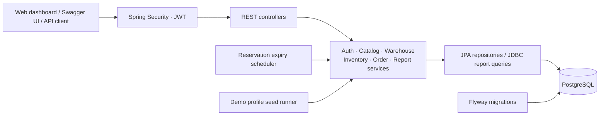
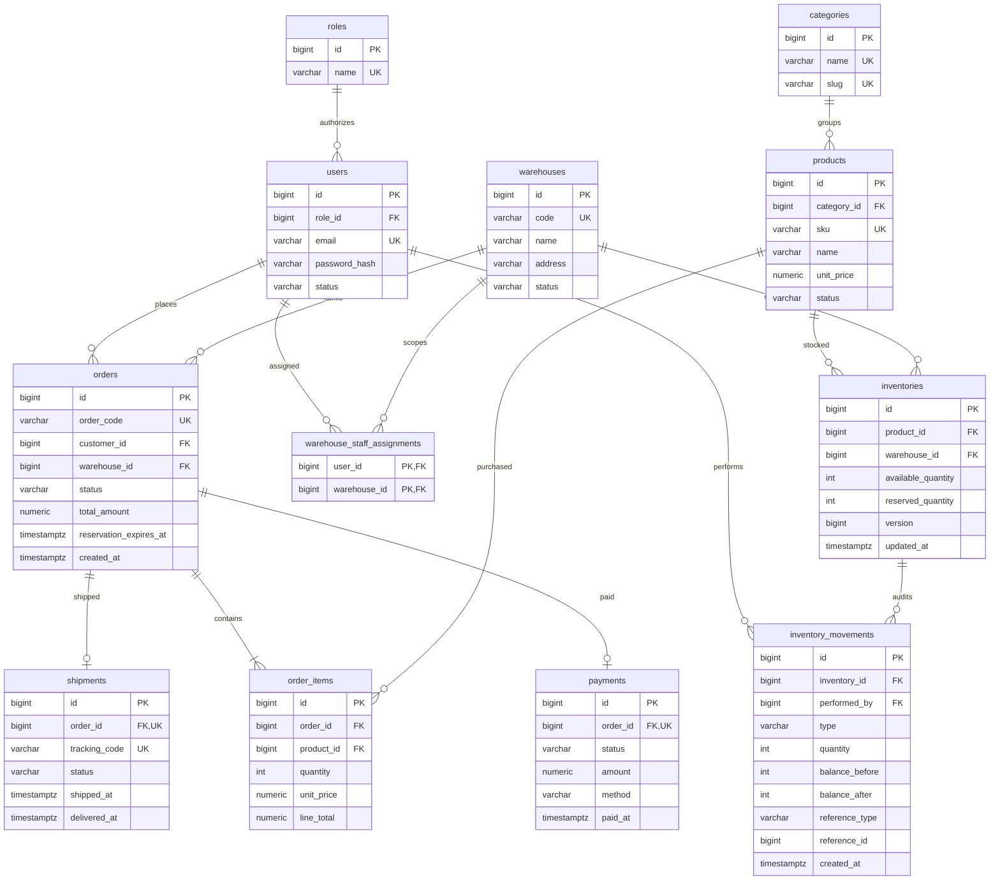

<!-- Tài liệu showcase mô tả đúng nghiệp vụ đã triển khai, cách chạy demo và bằng chứng kiểm thử/SQL. -->
# StockFlow – Multi-Warehouse Order and Inventory Management System

A Java backend portfolio project for a retailer managing products, orders, and inventory across multiple warehouses. StockFlow focuses on transactional correctness: concurrent customers cannot oversell stock, every inventory change produces an immutable audit entry, and reports aggregate actual order data.

## Technical goals

- Keep inventory consistent across order creation, payment simulation, cancellation, and reservation expiry.
- Enforce both role permissions and resource ownership, including warehouse assignments for staff.
- Make SQL performance decisions using measured query plans.
- Provide a reproducible demo, documented API, automated tests, and a packaged application.

## Tech stack

| Area | Technology |
| --- | --- |
| Language and framework | Java 17, Spring Boot 3.4.5 |
| Persistence | PostgreSQL, Spring Data JPA / Hibernate, Spring JDBC |
| Schema management | Flyway; Hibernate schema validation |
| Authentication | Spring Security, JWT, BCrypt |
| API documentation | SpringDoc OpenAPI 2.8.5, Swagger UI |
| Validation and tests | Jakarta Bean Validation, JUnit 5, Spring Boot Test, MockMvc, H2 |
| Build and delivery | Maven Wrapper, Docker Compose, GitHub Actions |

H2 provides isolated integration tests without requiring Docker. PostgreSQL remains the application database; its ledger trigger and report query plans are database-specific.

## Architecture

The application is a modular monolith. Controllers handle HTTP and role checks, services define transaction boundaries and ownership rules, and repositories implement persistence.



## Database ERD



An inventory is unique per `(product_id, warehouse_id)`; an order has at most one payment and one shipment. Order items snapshot prices so later catalog edits cannot change an existing order's amount.

## Engineering highlights

### Concurrency control

Stock reservation uses an **atomic conditional update**, with the stock check performed by the database in the same statement:

```sql
UPDATE inventories
SET available_quantity = available_quantity - :quantity,
    reserved_quantity = reserved_quantity + :quantity,
    version = version + 1,
    updated_at = now()
WHERE id = :inventoryId
  AND available_quantity >= :quantity;
```

Zero affected rows produces `409 Conflict`. Reserving all items, creating the order, and recording movements happen in one transaction; insufficient stock for any item rolls back the entire order.

Items are processed in ascending inventory ID order so concurrent orders acquire inventory locks consistently, preventing the reversed-item deadlock scenario. Payment, cancellation, and expiry also lock the order row to keep transitions and repeated requests consistent.

The concurrency integration test starts **24 buyers competing for 5 units**, checks that exactly 5 orders succeed, and verifies that available stock never becomes negative. Additional tests exercise reversed item order and competing payment/cancellation/expiry requests.

### Immutable audit ledger

`inventory_movements` stores the actor, quantity, physical balance before/after, timestamp, and optional business reference. A **PostgreSQL database trigger rejects UPDATE and DELETE**, including direct SQL attempts. Corrections produce new movements rather than rewriting history.

`physical_quantity = available_quantity + reserved_quantity`. Reserving or releasing changes allocation while keeping physical stock unchanged; payment simulation records a dispatch and reduces physical stock. Initial demo inventory is received through the same transactional stock-in service.

### SQL optimization

Measured with `EXPLAIN (ANALYZE, BUFFERS)` on PostgreSQL 13.2, using a benchmark dataset of **100,000 generated orders and 500,000 order items**:

| Query | Before | After | Improvement |
| --- | ---: | ---: | ---: |
| Top products | 25.507 ms | 4.471 ms | 5.70× |
| Revenue | 0.950 ms | 0.279 ms | 3.41× |

These are medians of five warm-cache samples for the SELECT query, excluding pagination count queries and HTTP overhead. A partial covering index for revenue-bearing orders enables an index-only scan for the measured workload; index selection still depends on selectivity and database statistics.

See [SQL optimization report](docs/sql-optimization-report.md) for SQL, query plans, benchmark conditions, and reproduction commands. The small demo seed is separate from this performance dataset.

## Quickstart

### One command with Docker Compose

Prerequisite: Docker with Compose support and network access for the first image/dependency download.

```bash
docker compose up --build
```

Compose builds the application with Java 17 and the Maven Wrapper, starts PostgreSQL, waits for its health check, and starts the API with the `demo` profile.

- Web demo dashboard: [http://localhost:8080/](http://localhost:8080/)
- Swagger UI: [http://localhost:8080/swagger-ui.html](http://localhost:8080/swagger-ui.html)
- OpenAPI JSON: [http://localhost:8080/v3/api-docs](http://localhost:8080/v3/api-docs)
- Health: [http://localhost:8080/api/v1/health](http://localhost:8080/api/v1/health)
- PostgreSQL from the host: `localhost:5433`, database/user `stockflow`, password `stockflow_local_password`.

The application container connects to `postgres:5432`. The host database port can be changed with `DB_PORT`; `APP_PORT` changes the published API port. Run `docker compose down` to stop the demo while retaining the database volume.

### Run with the Maven Wrapper

Prerequisites: Java 17 and a PostgreSQL instance. To use the Compose database while running Java locally:

```bash
docker compose up -d postgres
chmod +x mvnw
./mvnw -Dspring-boot.run.profiles=demo spring-boot:run
```

Windows PowerShell:

```powershell
docker compose up -d postgres
.\mvnw.cmd '-Dspring-boot.run.profiles=demo' spring-boot:run
```

The local datasource defaults match the Compose database. Customize `DB_HOST`, `DB_PORT`, `DB_NAME`, `DB_USERNAME`, and `DB_PASSWORD` through environment variables or an IDE run configuration.

Compose reads an optional `.env` file; use [.env.example](.env.example) as its template. **Spring Boot launched directly does not automatically load `.env`.**

The `demo` profile supplies a local JWT key and seeds demo data. When running without this profile, set `JWT_SECRET` to a private key of at least 32 bytes. Demo credentials and the demo JWT key are intended for local evaluation.

## Web demo dashboard

Open **[http://localhost:8080/](http://localhost:8080/)** after starting Spring Boot. The Vietnamese dashboard is served directly from `src/main/resources/static/` with HTML, CSS, and vanilla JavaScript. No Node.js installation or separate frontend build is needed.

- Switch between **Admin, Manager, Staff Kho HN, and Customer** using the demo login buttons; each performs a real JWT login. Manual login and customer registration are also available.
- Browse/filter/paginate products, build a multi-product cart, select an active warehouse, and create a 15-minute reservation as Customer.
- View your orders or look up an order ID, confirm simulated payment, cancel eligible orders, and inspect item price snapshots/countdowns.
- Inspect available/reserved/physical inventory, receive stock as Admin/assigned Staff, and read immutable before/after balances as Manager/Admin.
- Inspect order status totals, day/month revenue, top products, and low-stock alerts with filters and pagination.
- API banners/toasts show actual backend responses, including **409 Conflict** for insufficient stock and **403 Forbidden** for denied access. Permission cards include a button to demonstrate the server's access check.

The authenticated endpoint `GET /api/v1/warehouses/order-options` supplies only active warehouse IDs, codes, and names for order selection. The operational `GET /api/v1/warehouses` endpoint retains its existing role restrictions. No warehouse IDs are hard-coded in the frontend.

JWTs are kept in the tab's sessionStorage; passwords entered manually are not persisted. Logging out or switching demo accounts clears cart/private results and cancels old requests. On refresh, the role is validated again with `users/me`. Role-based UI controls supplement server authorization.

For an existing PostgreSQL installation in IntelliJ, use Active profiles `demo` and set `DB_PORT`, `DB_USERNAME`, and `DB_PASSWORD` to that installation's credentials (for example, port 5432 and user postgres). This runs the demo seed in the selected database. The Compose database defaults to host port 5433.

## Demo data and accounts

A fresh demo database contains three warehouses:

- **WH-HAN-01** — Kho Tổng Hà Nội.
- **WH-DAD-01** — Kho Đà Nẵng.
- **WH-SGN-01** — Kho TP.HCM.

There are four categories (Điện tử, Gia dụng, Thời trang, Phụ kiện), **24 products**, and **72 inventory rows with 72 GOODS_RECEIPT movements**. Selected products start below the low-stock threshold to make the alert report useful immediately. Prices are sample VND values.

| Email | Password | Role | Scope |
| --- | --- | --- | --- |
| admin@stockflow.com | Admin@123 | ADMIN | All warehouses; catalog administration |
| manager@stockflow.com | Manager@123 | MANAGER | Orders, inventory, ledger, reports |
| staff.hn@stockflow.com | Staff@123 | WAREHOUSE_STAFF | Assigned to WH-HAN-01 |
| customer@stockflow.com | Customer@123 | CUSTOMER | Own orders |

Passwords are stored as BCrypt hashes. The seed only adds missing records and inventory pairs; restarting preserves existing prices, passwords, orders, and stock quantities, including inventories that have sold out.

Revenue and top-product reports populate as you create and pay demo orders. The seed does not fabricate historical sales.

## API walkthrough

1. Open Swagger UI and execute `POST /api/v1/auth/login` with a demo email and password.
2. Copy `access_token`, click **Authorize**, and paste the token without the `Bearer ` prefix.
3. Browse `GET /api/v1/products`. Retrieve active warehouse IDs through authenticated `GET /api/v1/warehouses/order-options`.
4. Authorize as the customer and create an order with `POST /api/v1/orders`:

```json
{
  "warehouse_id": 1,
  "items": [
    { "product_id": 1, "quantity": 2 }
  ]
}
```

Use IDs returned by your own database; the example IDs are placeholders.

5. The order starts `PENDING` with stock reserved for **15 minutes**. Check `GET /api/v1/orders/my`.
6. Call `POST /api/v1/orders/{id}/payment-simulations/confirm`: the order becomes `CONFIRMED`, the payment becomes `PAID`, and reserved stock is dispatched. Repeating confirmation creates no extra payment or dispatch.
7. Alternatively, cancel a pending order to release stock. Expired reservations are automatically released by the scheduled task.
8. Authorize as manager to inspect inventory movements and the revenue/top-products reports. Reports use UTC order creation dates; use a date range covering the demo orders.

### Endpoint permissions

- **Public:** web dashboard/static assets, health, registration/login, category/product reads, Swagger UI, OpenAPI documents.
- **Authenticated users:** minimal active warehouse choices for order creation (`/api/v1/warehouses/order-options`).
- **ADMIN:** category/product writes and warehouse creation; stock-in across warehouses.
- **WAREHOUSE_STAFF:** stock-in and inventory/order reads within assigned warehouses. Inventory requests must include an assigned `warehouseId`.
- **CUSTOMER:** create orders, read own orders, pay own orders, cancel own pending orders.
- **MANAGER / ADMIN:** cross-warehouse order reads, inventory, audit movements, and all four report endpoints; cancel paid orders before shipment with restocking/refund.

Report endpoints: `/api/v1/reports/revenue`, `/top-products`, `/low-stock`, and `/order-summary`. Revenue supports day/month grouping; paginated reports accept `page` and `size`.

## Tests, build, and CI

macOS/Linux:

```bash
chmod +x mvnw
./mvnw test
./mvnw package
```

Windows PowerShell:

```powershell
.\mvnw.cmd test
.\mvnw.cmd package
```

If your environment requires an explicit Maven cache, append `'-Dmaven.repo.local=C:/Users/Admin/.m2/repository'` on Windows.

The suite covers authentication, role/ownership checks, stock-in transactions, immutable ledger enforcement, order lifecycle, concurrency, report aggregates/pagination, OpenAPI access, repeatable demo seeding, public web resource delivery, and warehouse order-option permissions.

See [Web demo verification](docs/web-demo-verification.md) for the changed files, 89-test result, and frontend checks against a separate PostgreSQL database.

GitHub Actions runs `./mvnw test` on pushes and pull requests targeting `main`, using Ubuntu and Temurin Java 17. It then packages and uploads the application JAR. The database tests use H2 and do not require a database service in CI.

The packaged artifact is `target/stockflow-0.0.1-SNAPSHOT.jar`. To run it locally:

```bash
java -jar target/stockflow-0.0.1-SNAPSHOT.jar --spring.profiles.active=demo
```

## Scope and trade-offs

The current API includes catalog administration, warehouse-scoped inventory, stock receipts, reservations, simulated payments, cancellation/refund, reservation expiry, and business reports. Shipment entities/statuses are modeled; packing, shipping, delivery, and customer return endpoints remain future extensions. Payment is a simulation.

The Vietnamese thin frontend is ready for local walkthroughs. A public deployment and a recorded demo can be added for the final CV presentation.

Integration references: [SpringDoc v2](https://springdoc.org/v2/), [GitHub Actions Java/Maven](https://docs.github.com/en/actions/tutorials/build-and-test-code/java-with-maven), [Compose startup dependencies](https://docs.docker.com/compose/how-tos/startup-order/).
